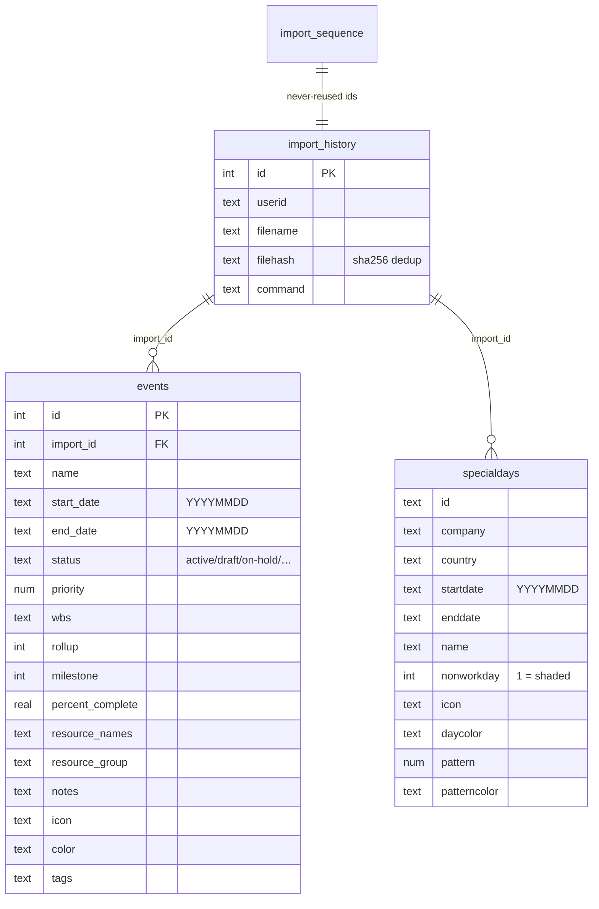
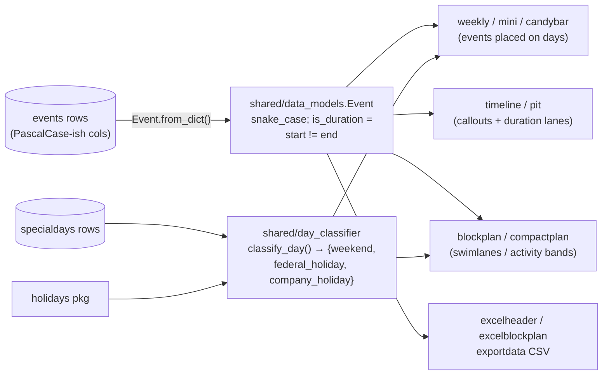

# Data model

## calendar.db

Standalone lookup tables (no relations): `icon` (name → SVG),
`patterns` (name → SVG tile), `palettes` (name → ordered colors),
`colors` (named colors), `papersizes`.

**Government holidays are not stored.** `CalendarDB.load_python_holidays()`
loads them per country and date range from the `holidays` Python package
into memory. Every category the package reports for a country is loaded
(discovered from `supported_categories`, not a fixed list): public,
government, bank and de-facto kinds are marked `nonworkday=1`; all other
kinds — optional, half-day, unofficial, school, workday, armed-forces and
the religious/ethnic ones — get titles without shading. Country-wide
holidays only; subdivision (state/province) holidays are not loaded.

## From rows to renderers

Notes:

- `Event.from_dict()` accepts both DB column spellings (`Task_Name`,
  `Start`, `End`/`Finish`, `Datekey`) and snake_case; everything downstream
  uses the dataclass, never raw dicts.
- Dates are `YYYYMMDD` strings end to end; they sort lexicographically,
  which the row-packing algorithms rely on.
- `--status` filters events by the `status` column; non-active statuses
  render dimmed (see `_STATUS_OPACITY` in the weekly renderer).
- Import provenance: every imported row carries `import_id`;
  `import_history.filehash` (SHA-256) is the duplicate-import guard, and
  `import_sequence` guarantees ids are never reused even after removals.
