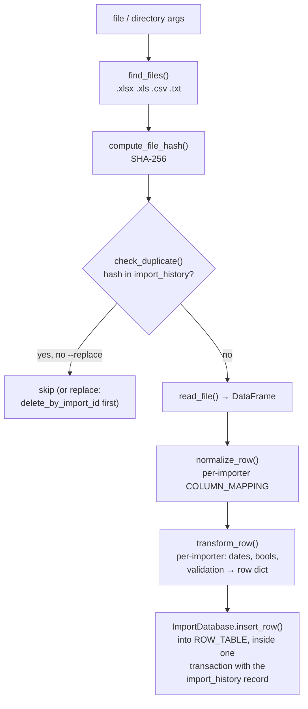

# Importers

Two row importers share one framework (`importers/common.py`); the small
content importers (`import_icons.py`, `import_patterns.py`,
`import_rcairo_colors.py`) are standalone one-shot loaders.

## The split of responsibilities

`importers/common.py` owns everything generic:

| Piece | What it does |
|---|---|
| `ImportDatabase` base | `ROW_TABLE`/`UNIT_LABEL` class attrs; import_history CRUD, never-reused id sequence, hash dedup, `--replace` deletion, `extra_migrations()` hook |
| file helpers | `find_files`, `determine_file_type`, `read_file`, `compute_file_hash` |
| date/value parsing | `convert_date` (dateutil, <1950 = parse failure), `process_dates` (missing-side fill + swap) |
| CLI actions | `list_import_history`, `remove_import`, `parse_import_pattern` ("3", "1-5", "-3", "5-", "1,3", "all") |

Each importer supplies only its column mapping, `transform_row()`,
`import_file()` orchestration, and `main()`:

- **import_events.py** → `events` table; also has generator-script mode
  (`--generate script.py` calls the script's `generate_events()` and
  imports the returned DataFrame).
- **import_specialdays.py** → `specialdays` table; adds country/language
  defaulting and boolean parsing (`parse_bool`).

The TUI (`tui/importers_spec.py`) drives the same CLIs; keep flag surfaces
stable or update the spec alongside.

Historical note: `import_holidays.py` was deleted 2026-07 — it targeted a
`government` table that no longer exists; government holidays load at
render time from the `holidays` package (see data-model.md).
