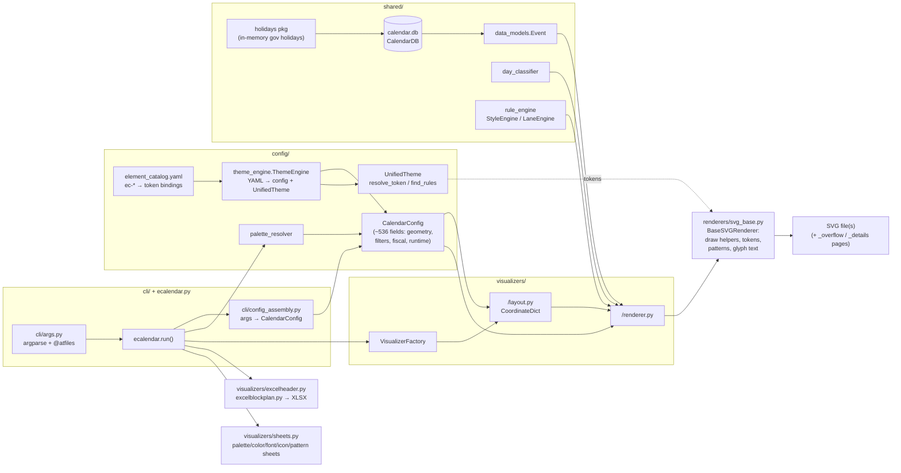

# System overview

EventCalendar turns a SQLite events database plus a YAML theme into SVG
calendars (and two Excel exports). Everything enters through
`ecalendar.py run()`.

Key facts:

- **Text is geometry.** All text renders as `<path>` glyph outlines
  (fonttools + `renderers/glyph_cache.py`); no fonts are embedded. Text
  widths come from PIL `ImageFont.getlength()`.
- **Two coordinate systems.** Layouts produce PDF-style coordinates
  (origin bottom-left, Y up); `BaseSVGRenderer._svg_y()` flips to SVG
  (Y down). Day boxes are keyed `YYYYMMDD` in the CoordinateDict.
- **Government holidays are not in the DB.** `CalendarDB.load_python_holidays()`
  pulls them from the `holidays` package per country/date-range at run time.
  The DB holds events, company special days, icons, patterns, palettes,
  colors, paper sizes, and import history.
- **One shared base renderer.** Token cache (`_tk`), SVG pattern defs,
  header/footer/watermark chrome, the overflow table, and all draw
  primitives live on `BaseSVGRenderer`; visualizer renderers override
  `_render_content()`.
- **Guard rails.** `tools/refcorpus.sh check` diffs 34 reference SVGs
  (9 visualizers × 3 themes) byte-for-byte modulo `<desc>`; the test suite
  (~580 tests) runs in under 10 s.
