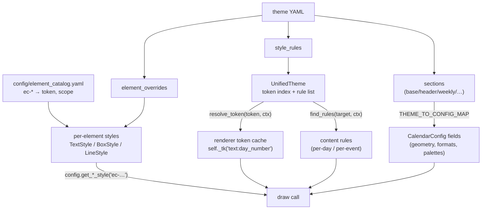

# Theme resolution — YAML to pixels

A theme YAML has three kinds of styling content, resolved through different
paths that meet in the renderer:

## The precedence chain at a draw site

Most draw sites resolve each attribute through this chain (first hit wins):

1. **Per-item override** — a matching content rule's `StyleResult`
   (e.g. federal-holiday tint, sprint highlight) or a per-band/lane dict key.
2. **Token** — `self._tk("text:event_name").get("size")` from the
   per-render cache. Rules opt into contexts via `select:`
   (`visualizer:`, `papersize:`, day-class keys, `priority_min/max` …);
   definitions (empty `select:`) always apply, conditional rules layer
   last-wins in declaration order.
3. **Element style** — `config.get_text_style("ec-event-name")` etc.;
   the element's token binding comes from the catalog, per-theme tweaks
   from `element_overrides:`.
4. **Legacy config field / module default** — the no-theme fallback
   (`config.py _fallback_*_style` factories and plain fields).

## Font sizes specifically

`setfontsizes()` consults `theme.resolve_token(...)["size"]` per field and
falls back to a page-height heuristic; `_inject_heuristic_size_tokens()`
then writes the heuristic values back as synthetic token rules
(`_HEURISTIC_TOKEN_FIELDS` in `config/config.py`) so renderers can read
`tk.get("size")` unconditionally. Net effect: theme sizes win, heuristics
fill every gap.

## Who validates what

- `theme_engine` rejects legacy sections (old `hash_rules`,
  `swimlanes[].match`, `apply_to: element`) with pointers to
  `tools/migrate_theme.py` / `tools/strip_element_bindings.py`.
- `config/required_keys.py` powers `tools/validate_theme.py` — missing
  required keys are reported with example values from `basic.yaml`.
- Unknown *sections* warn; unknown keys inside valid sections are ignored
  silently — a misspelled key is a silent no-op, so `validate_theme` is
  worth running on hand-edited themes.
