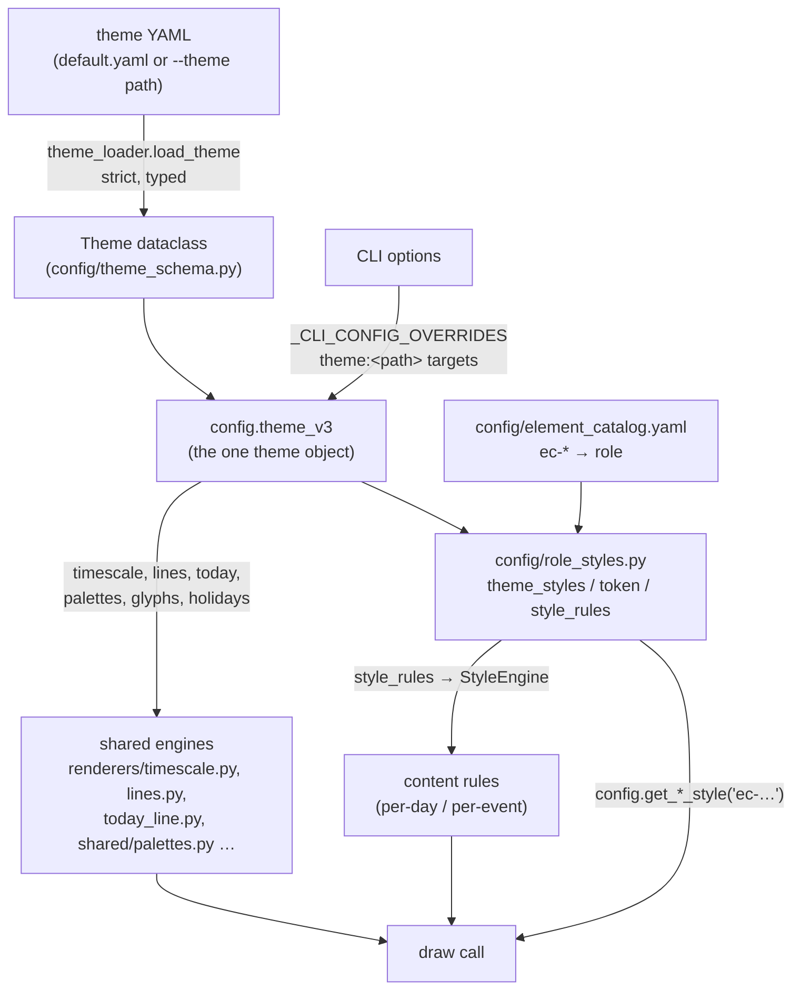

# Theme resolution — YAML to pixels

A theme is one version-3.0 YAML file. There is no inheritance, no legacy
section support and no fallback layer: the loader either returns a complete
`Theme` or raises `ThemeError`.

```mermaid
flowchart TD
    Y["theme YAML<br/>(default.yaml or --theme path)"] -->|"theme_loader.load_theme<br/>strict, typed"| T["Theme dataclass<br/>(config/theme_schema.py)"]
    T --> CFG["config.theme_v3<br/>(the one theme object)"]
    CLI["CLI options"] -->|"_CLI_CONFIG_OVERRIDES<br/>theme:&lt;path&gt; targets"| CFG
    CFG --> RS["config/role_styles.py<br/>theme_styles / token / style_rules"]
    CAT["config/element_catalog.yaml<br/>ec-* → role"] --> RS
    RS -->|"config.get_*_style('ec-…')"| DRAW["draw call"]
    CFG -->|"timescale, lines, today,<br/>palettes, glyphs, holidays"| ENG["shared engines<br/>renderers/timescale.py, lines.py,<br/>today_line.py, shared/palettes.py …"]
    ENG --> DRAW
    RS -->|"style_rules → StyleEngine"| CR["content rules<br/>(per-day / per-event)"]
    CR --> DRAW
```

## Loading

`cli/config_assembly.load_run_theme(config, name)` calls
`config.theme_loader.load_theme(name or "default")` and stores the result in
`config.theme_v3`. It runs **before** any option is applied, so every CLI
option that overlaps the theme is applied afterwards and wins
(`_CLI_CONFIG_OVERRIDES` in `cli/config_assembly.py`; a target is either a
`CalendarConfig` field or `theme:<dotted.path>`, written with
`config/theme_paths.set_path`).

The loader rejects a missing or other `version`, unknown keys at any depth,
wrong types, unknown font names, malformed style rules and unknown details
columns. A theme from an older schema raises `UnsupportedThemeError`.
Loading is the validation; there is no separate validator.

## Declare once, honoured by every view

Decoration lives at the top level of the theme, never inside a view block:
fonts, palettes, the `text`/`boxes`/`icons`/`lines` role tables, `timescale`
(primary and secondary rows, ticks, vlines, fills, holidays), today line,
holidays, fiscal, glyph groups, `style_rules` and `details`. View blocks
(`weekly:`, `mini:`, `blockplan:` …) hold structure only. Every view reads
the same `config.theme_v3`.

## Resolving a style at a draw site

1. **Style rules** — `StyleEngine` rules whose `select:` matches the item
   (day class, event fields, priority, papersize …) are layered last-wins
   over the role's base style; the result is the per-item override.
2. **Role** — `role_styles.token(theme, name, papersize)` and `theme_styles`
   build `TextStyle`, `BoxStyle`, `LineStyle` and `IconStyle` from the role
   tables. Font sizes scale with the paper size inside `role_styles`.
3. **Element** — each `ec-*` CSS class in `config/element_catalog.yaml` is
   bound to a role; `config.get_text_style("ec-…")` returns that role's
   style. The catalog carries no values.

There is no fourth layer: a value missing from the theme is a load error,
not a hard-coded default at the draw site.

## Palettes

`shared/palettes.resolve_theme_palettes` turns the `palettes:` section into
concrete color lists (month, fiscal, group) once per run; partial overrides
merge over palette-derived maps.
